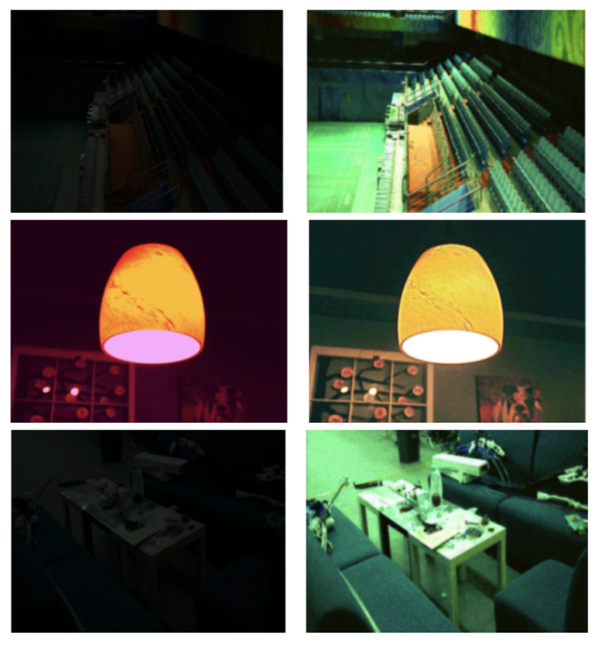

# ZERO-IG

### Zero-Shot Illumination-Guided Joint Denoising and Adaptive Enhancement for Low-Light Images [cvpr2024]

By Yiqi Shi, Duo Liu, LiguoZhang,Ye Tian, Xuezhi Xia, Xiaojing Fu


#[[Paper]](https://openaccess.thecvf.com/content/CVPR2024/papers/Shi_ZERO-IG_Zero-Shot_Illumination-Guided_Joint_Denoising_and_Adaptive_Enhancement_for_Low-Light_CVPR_2024_paper.pdf)   [[Supplement Material]](https://openaccess.thecvf.com/content/CVPR2024/supplemental/Shi_ZERO-IG_Zero-Shot_Illumination-Guided_CVPR_2024_supplemental.pdf)


## Overview

Low-light images suffer from poor visibility, noise, and low contrast. Traditional methods are not adaptive, while deep learning methods require large paired datasets.

This project implements and extends **ZERO-IG**, a **zero-shot framework** that performs **joint denoising and enhancement** using illumination guidance. The model learns directly from a single image without requiring any training dataset.

---

## Key Idea

Based on **Retinex Theory**:

- Image = **Illumination × Reflection**
- Illumination → brightness (smooth)
- Reflection → details + noise

ZERO-IG jointly performs:
-  Denoising  
-  Enhancement  

---

##  Architecture

The model consists of three main components:

- **LD-Net (Denoise 1)** → Initial denoising  
- **IE-Net (Enhancer)** → Illumination estimation  
- **RD-Net (Denoise 2)** → Final denoising  

---

##  Our Contributions

We improved the baseline ZERO-IG model by:

- **Residual Blocks**
  - Better gradient flow  
  - Improved feature extraction

- **Channel Attention**
  - Focus on important features  
  - Better noise-detail separation  

- **Perceptual Loss**
  - Preserves textures and edges  
  - Improves visual quality  

---

##  Project Structure

```
ZERO-IG/
│
├── Figs/
│   ├── Dataset.png
│   └── Fig3.png
│
├── data/                # Dataset folder
│
├── weights/             # Pretrained / trained models
│   ├── LOL.pt
│   ├── LSRW-Huawei.pt
│   └── LSRW-Nikon.pt
│
├── model.py             # Model architecture
├── loss.py              # Loss functions
├── train.py             # Training script
├── test.py              # Testing script
├── multi_read_data.py   # Data loading
├── utils.py             # Utility functions
│
└── README.md
```
##  Requirements

- Python 3.7  
- PyTorch 1.13.0  
- CUDA 11.7  
- Torchvision 0.14.1  

---

##  How to Run

###  1. Training

- Set dataset path in `train.py`  
- Run:

```bash
python train.py
```
###  2. Testing

- Place test images in the `data/` folder  
- Select pretrained model from `weights/`  

Run:

```bash
python test.py
```

- Output images will be saved in the ```results/``` folder

##  Results

### Quantitative Results

| Model | PSNR | SSIM |
|------|------|------|
| Baseline ZERO-IG | 16.61 | 0.47 |
| Improved Model | 18.04 | 0.53 |

- Better reconstruction (PSNR)  
- Improved structural & perceptual quality (SSIM)

---

##  Qualitative Results

- Sharper images with better textures  
- Reduced noise in dark regions  
- Balanced illumination without overexposure  


---


##  Analysis

- Residual blocks → improved feature learning  
- Channel attention → better focus on important details  
- Perceptual loss → sharper and more realistic outputs  

---

##  Conclusion

The enhanced ZERO-IG model achieves improved denoising, better detail preservation, and more natural image enhancement while maintaining the flexibility of zero-shot learning.
